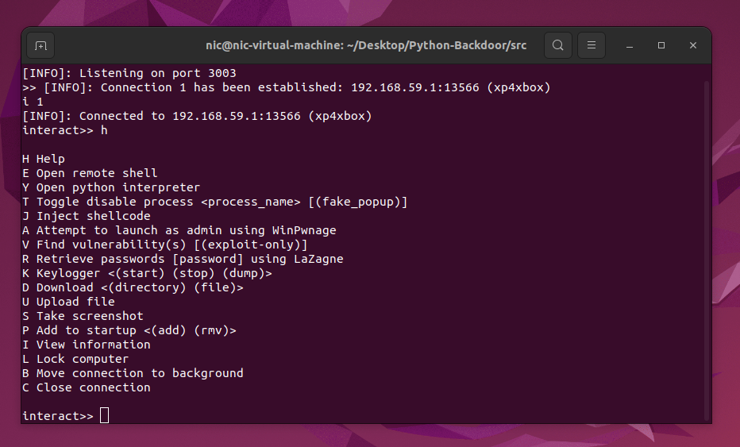

# Python Backdoor

This project is a cross-platform (Windows/Linux/MacOS) open source, backdoor/reverse tcp/RAT made in Python3 which contains many features such as multi-client support.

## Installation

You will need:

* [Python](https://www.python.org/downloads) 
* One of the following
  * Windows
  * MacOS Big Sur or higher (earlier versions may not work with pyinstaller)
  * Linux

1. Download via git `git clone https://github.com/xp4xbox/Python-Backdoor --recursive`
2. Install the project requirements by running `python -m pip install -r requirements.txt`
3. Install each submodule requirements by running the following:
- `python -m pip install -r src/submodule/LaZagne/requirements.txt`

## Features

Currently, this program has several features, notably:

* Multi-client support
* Cross-platform server and client
* Fernet encryption
* Built-in keylogger
* Send commands to all clients
* Capture screenshots
* Upload/download files
* Open remote shell or python interpreter
* Dump various passwords with [LaZagne](https://github.com/AlessandroZ/LaZagne)
* UAC Bypass with [WinPwnage](https://github.com/rootm0s/WinPwnage)*
* Disable a process*
* Inject shellcode*
* VM/sandboxie check*
* Add to startup*
* Ability to melt file*

> Asterisk means only supported on Windows 

## Quick Usage

1. Open `src/setup.py` in python and configure options to build the client
2. Check the `dist` folder for the binary.
3. Disable your firewall on the server or configure your firewall to allow the port chosen.
4. Run the `src/main_server.py -p <port>` to start the server and accept connections.

> If you plan on using the program with DNS hostname or external IP, you must port forward your chosen port.
> The setup uses tkinter, install if not already installed `eg. sudo apt-get install python3-tk`.

### Command Arguments
- Arrows `<>` represent mandatory argument
- Square brackets `[]` represents optional argument
- Brackets `(arg)` in either above mean `arg` is the exact argument

eg. 
- `I Interact with a connection <index>` `i 1`
- `L List all connections [(inactive)]` `l` or `l inactive`

## Common problems & Solutions

- Injecting shellcode requires the architecture specified by the command. eg. x64: `msfvenom windows/x64/meterpreter/reverse_tcp`
- For use outside of network specified port is not open, check specified port with a [port scanner](https://www.whatismyip.com/port-scanner/)

## Disclaimer

This program is for educational purposes only. I take no responsibility or liability for own personal use.

## License

[License](https://github.com/xp4xbox/Python-Backdoor/blob/master/license)
